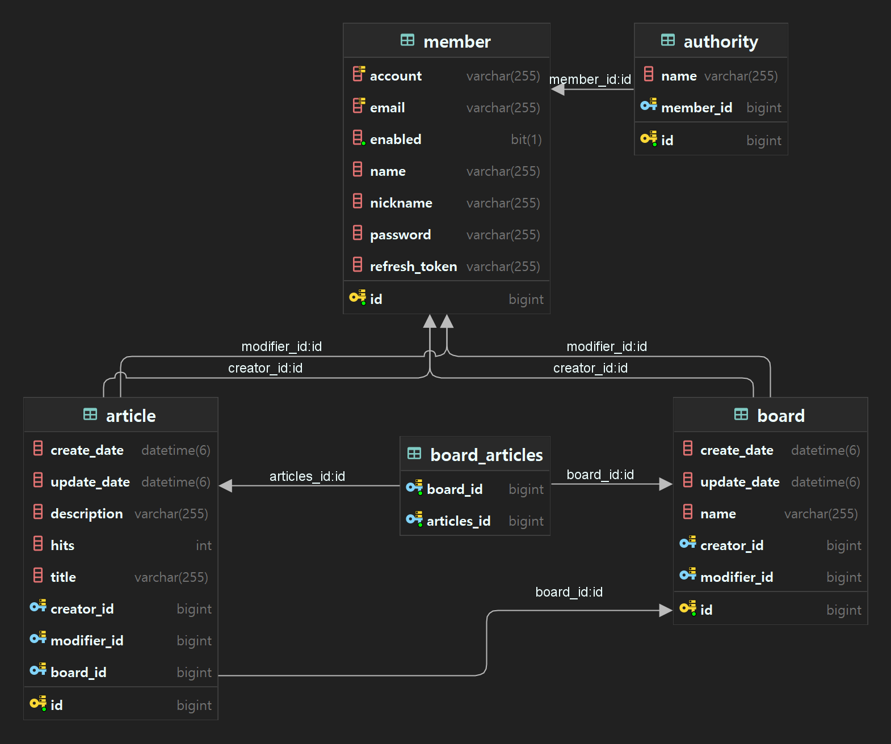

# 최준호의 개인 홈페이지

개인 홈페이지를 만들어보고싶어서 만들어본 프로젝트입니다

사용해보고싶은 기술스택도 막 적용해보기 위한 토이 프로젝트

# Table 구조

**테이블 구조 지속 업데이트 예정**

# 기능 목록

권한 계층

`ADMIN` > `MANAGER` > `USER`

## 인증 API

| Method | URL  | Description | 접근권한 |
|--------|------|-------------|------|
| POST   | `/signin` |  로그인        | ALL  |
| POST   | `/signup` |  회원가입        | ALL  |
| POST   | `/signout` |  로그아웃        | USER |
| POST   | `/refresh` |  토큰 재발급        | USER |

## 회원관리

| Method | URL      | Description | 접근권한 |
|--------|----------|-------------|------|
| GET | `/user`  | 회원 단건조회 | ALL  |
| GET | `/users` | 회원목록 조회 | ALL  |

## 게시판 API

| Method | URL                     | Description | 접근권한  |
|--------|-------------------------|-------------|-------|
| GET | `/board/list`           | 게시판 목록      | ALL   |
| POST | `/board/post`           | 게시판 생성      | ADMIN |
| PUT | `/board/{id}`           | 게시판 정보 수정   | ADMIN |
| DELETE | `/board/{id}`           | 게시판 삭제      | ADMIN |

## 게시물 API

- 게시물을 등록, 조회, 수정, 삭제 할 수 있습니다.

| Method | URL                       | Description | 접근권한 |
|--------|---------------------------|-------------|------|
| GET | `/article/list`           | 게시물 목록      | ALL  |
| GET | `/article/{boardId}/list` | 게시물 목록      | ALL  |
| GET | `/article/{id}`           | 게시물 조회      | ALL  |
| POST | `/article/post`           | 게시물 작성      | USER |
| PUT | `/article/{id}`           | 게시물 수정      | USER |
| DELETE | `/article/{id}`           | 게시물 삭제      | USER |

## 댓글 API

| Method | URL                         | Description | 접근권한 |
|--------|-----------------------------|-------------|------|
| GET | `/comment/{articleId}/list` | 댓글 조회       | ALL  |
| POST | `/comment/post`             | 게시물 작성      | USER |
| PUT | `/comment/{id}`             | 게시물 수정      | USER |
| DELETE | `/comment/{id}`             | 게시물 삭제      | USER |
